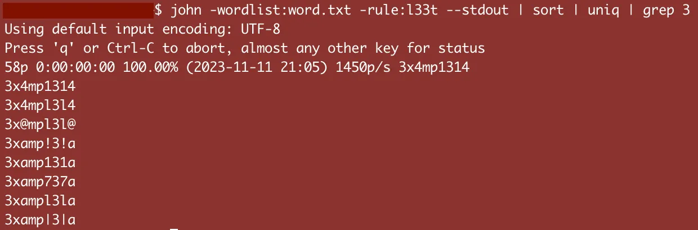
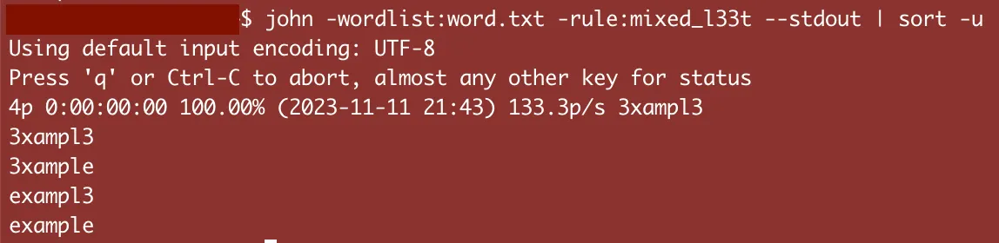
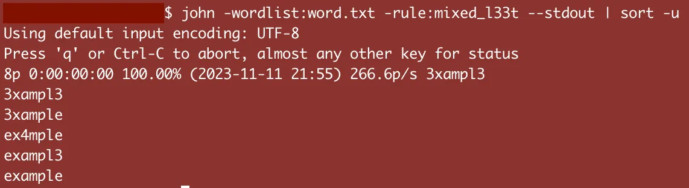
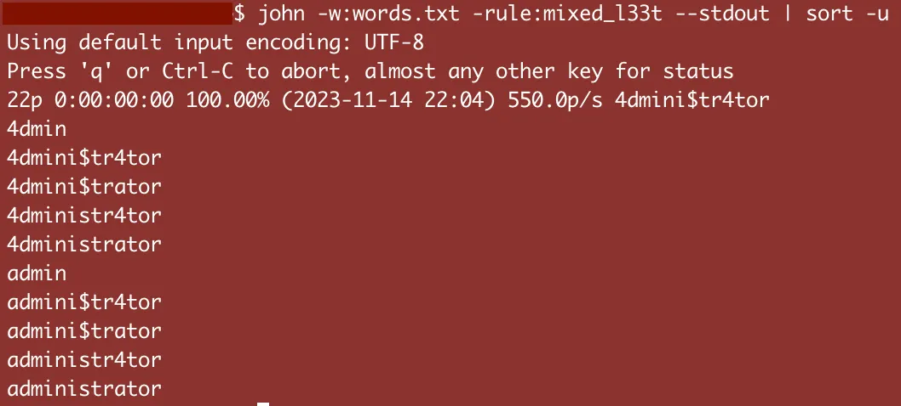

# Mixed L33t Rules Generator

Sharing a python tool I wrote that generates customizable, mixed l33t rules for JtR and Hashcat.

<figure markdown="span">
  
</figure>

<!-- more -->

## Discovering Gaps in L33t Wordlists

Recently, I needed to crack a password hash that I suspected was in some sort of l33t format. I tried the built-in JtR "l33t" rule and also "KoreLogicRulesL33t", but those couldn't crack it. I reviewed both output wordlists and noticed the rules were only replacing all instances of a flagged char.

<figure markdown="span">
<figcaption>All flagged chars (e, a, l) being replaced, or not</figcaption>
</figure>

I needed a l33t rule that would permute all possible l33t combinations for a word, like "example", "3xample", "exampl3", and "3xampl3".

## Creating Mixed L33t

Google didn't turn up any good comprehensive mixed l33t rules, but I found a few results that helped me arrive at the following three base rules:

```
/{old} op[{old}{new}]
%2{old} op[{old}{new}] /{old} op[{old}{new}]
%3{old} op[{old}{new}] %2{old} op[{old}{new}] /{old} op[{old}{new}]
```

To explain these, rules I'll run through them using the word "example", where {old} char = e and {new} char = 3.

The first rule places the first "e" with either "e" or "3", resulting in "example" and "3xample".

The second rule uses "%2e" to only run if there are 2 "e" chars in the input word. Then it proceeds to run two series of "either-or" alterations, similar to the first rule. Running the second rule over "example" outputs "example", "3xample", "exampl3", "3xampl3".

The third rule continues this pattern and runs when 3 "e" chars are found.

These three rules probably generate the majority of useful l33t permutations that I'd ever care about. I mean, how often do you come across a password with 4 a's in it? If I ever do, I'll just go add a fourth rule following this pattern.

<!-- prettier-ignore -->
!!! note "Note"
    In order for these rules to cover as many potential input words as possible, each with varying counts of {old} chars, some output word duplication occurs, so we have to sort and uniq the results.

<figure markdown="span">
<figcaption>Mixed l33t results - double the coverage!</figcaption>
</figure>

## Expanding Mixed L33t

Using the rules from above as a template, I produced three groups of three rules each: a=>4, s=>$, and e=>3.

```
/a op[a4]
%2a op[a4] /a op[a4]
%3a op[a4] %2a op[a4] /a op[a4]
/s op[s$]
%2s op[s$] /s op[s$]
%3s op[s$] %2s op[s$] /s op[s$]
/e op[e3]
%2e op[e3] /e op[e3]
%3e op[e3] %2e op[e3] /e op[e3]
```

I ran it over "example" and noticed that only one char was ever changed in any given output word. Line 3 below shows only the a=>4 being changed.

<figure markdown="span">

</figure>

This is because each of the rules are run individually, not in a series. I also noticed that was a lot of typing to just create three rule groups...but there are dozens of potential l33t translations! 😟

## Programmatically Generating and Mixing L33t Rules

My initial results had a few problems:

- typing out all these rules doesn't scale well
- only one l33t rule is applied at a time

To solve these, I wrote a python script called generate-mixed-l33t-rules.py that automates the creation of my rules, then mixes them all together using mathematical combinations. The resulting rules cover all possible arrangements of all of my rules (see output below). Then, in turn, all of my rules provide coverage over most common letter arrangements in an input word: a word with one "a" and two "e" chars, a word with 3 "i" chars and one "t", etc. I made the tool configurable, so you can add to the L33t Translation Table to modify the quantity and types of l33t translations (a=>4, s=>$, e=>3, …).

Running the tool over its default l33t config (a=>4, s=>$, e=>3) would produce the following rules that you can append into your john.conf file:

```
[List.Rules:mixed_l33t]
/a op[a4] %3s op[s$] %2s op[s$] /s op[s$] %3e op[e3] %2e op[e3] /e op[e3]
%3a op[a4] %2a op[a4] /a op[a4] %2s op[s$] /s op[s$] /e op[e3]
%2s op[s$] /s op[s$]
/a op[a4]
/a op[a4] %3e op[e3] %2e op[e3] /e op[e3]
%2a op[a4] /a op[a4]
%3a op[a4] %2a op[a4] /a op[a4] /e op[e3]
%3a op[a4] %2a op[a4] /a op[a4] %2s op[s$] /s op[s$] %2e op[e3] /e op[e3]
%2a op[a4] /a op[a4] %3s op[s$] %2s op[s$] /s op[s$]
%2a op[a4] /a op[a4] /s op[s$] %2e op[e3] /e op[e3]
/s op[s$] /e op[e3]
%2a op[a4] /a op[a4] /s op[s$] %3e op[e3] %2e op[e3] /e op[e3]
%3a op[a4] %2a op[a4] /a op[a4] %2e op[e3] /e op[e3]
%2a op[a4] /a op[a4] %3s op[s$] %2s op[s$] /s op[s$] /e op[e3]
/a op[a4] %3s op[s$] %2s op[s$] /s op[s$] %2e op[e3] /e op[e3]
%2a op[a4] /a op[a4] /s op[s$] /e op[e3]
%2a op[a4] /a op[a4] %2s op[s$] /s op[s$]
%3a op[a4] %2a op[a4] /a op[a4] %2s op[s$] /s op[s$] %3e op[e3] %2e op[e3] /e op[e3]
%3a op[a4] %2a op[a4] /a op[a4] %2s op[s$] /s op[s$]
%3a op[a4] %2a op[a4] /a op[a4]
%3s op[s$] %2s op[s$] /s op[s$] %3e op[e3] %2e op[e3] /e op[e3]
%3s op[s$] %2s op[s$] /s op[s$]
/a op[a4] %2e op[e3] /e op[e3]
%2e op[e3] /e op[e3]
/s op[s$]
%2a op[a4] /a op[a4] %2e op[e3] /e op[e3]
%3a op[a4] %2a op[a4] /a op[a4] %3s op[s$] %2s op[s$] /s op[s$]
%3a op[a4] %2a op[a4] /a op[a4] /s op[s$]
/s op[s$] %2e op[e3] /e op[e3]
/a op[a4] %2s op[s$] /s op[s$] /e op[e3]
%2a op[a4] /a op[a4] %3s op[s$] %2s op[s$] /s op[s$] %3e op[e3] %2e op[e3] /e op[e3]
/e op[e3]
%3a op[a4] %2a op[a4] /a op[a4] %3s op[s$] %2s op[s$] /s op[s$] %2e op[e3] /e op[e3]
/a op[a4] %3s op[s$] %2s op[s$] /s op[s$] /e op[e3]
/a op[a4] /s op[s$]
%3e op[e3] %2e op[e3] /e op[e3]
%3s op[s$] %2s op[s$] /s op[s$] %2e op[e3] /e op[e3]
%2a op[a4] /a op[a4] /e op[e3]
%3a op[a4] %2a op[a4] /a op[a4] %3s op[s$] %2s op[s$] /s op[s$] /e op[e3]
/s op[s$] %3e op[e3] %2e op[e3] /e op[e3]
/a op[a4] /s op[s$] %2e op[e3] /e op[e3]
%3a op[a4] %2a op[a4] /a op[a4] /s op[s$] /e op[e3]
%2a op[a4] /a op[a4] /s op[s$]
/a op[a4] /e op[e3]
%2a op[a4] /a op[a4] %2s op[s$] /s op[s$] %3e op[e3] %2e op[e3] /e op[e3]
%2s op[s$] /s op[s$] %2e op[e3] /e op[e3]
%2a op[a4] /a op[a4] %3s op[s$] %2s op[s$] /s op[s$] %2e op[e3] /e op[e3]
%3a op[a4] %2a op[a4] /a op[a4] /s op[s$] %2e op[e3] /e op[e3]
/a op[a4] /s op[s$] /e op[e3]
%2a op[a4] /a op[a4] %2s op[s$] /s op[s$] /e op[e3]
%2s op[s$] /s op[s$] %3e op[e3] %2e op[e3] /e op[e3]
/a op[a4] %2s op[s$] /s op[s$] %3e op[e3] %2e op[e3] /e op[e3]
%3s op[s$] %2s op[s$] /s op[s$] /e op[e3]
%3a op[a4] %2a op[a4] /a op[a4] /s op[s$] %3e op[e3] %2e op[e3] /e op[e3]
%2s op[s$] /s op[s$] /e op[e3]
/a op[a4] %2s op[s$] /s op[s$]
/a op[a4] %2s op[s$] /s op[s$] %2e op[e3] /e op[e3]
%3a op[a4] %2a op[a4] /a op[a4] %3s op[s$] %2s op[s$] /s op[s$] %3e op[e3] %2e op[e3] /e op[e3]
%3a op[a4] %2a op[a4] /a op[a4] %3e op[e3] %2e op[e3] /e op[e3]
/a op[a4] /s op[s$] %3e op[e3] %2e op[e3] /e op[e3]
%2a op[a4] /a op[a4] %2s op[s$] /s op[s$] %2e op[e3] /e op[e3]
%2a op[a4] /a op[a4] %3e op[e3] %2e op[e3] /e op[e3]
/a op[a4] %3s op[s$] %2s op[s$] /s op[s$]
```

After adding these rules to your john.conf, you can run them over a wordlist like this:

```
john -w:words.txt -rule:mixed_l33t --stdout | sort -u
```

With a wordlist of "admin" and "administrator", the results are:

<figure markdown="span">
<figcaption>Final results</figcaption>
</figure>

Happy hacking!

## References

- https://github.com/minispooner/generate-mixed-l33t-rules
- https://www.openwall.com/lists/john-users/2010/08/03/3
- https://www.openwall.com/john/doc/RULES.shtml
