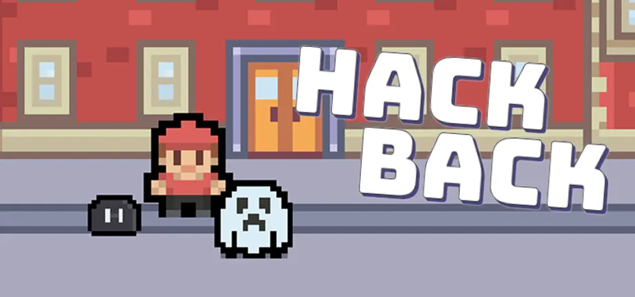
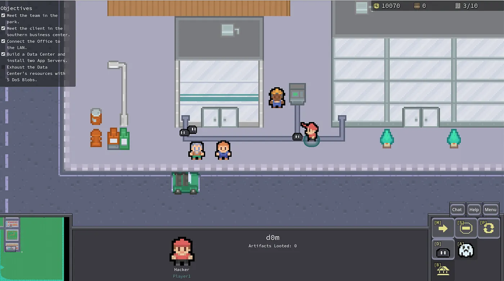

# "Hack Back" Game, Coming Soon…

I’ve been developing a computer game that immerses players in the battle between hackers and defenders.

<!-- more -->

Over the last year, I’ve been developing a computer game that immerses players in the battle between hackers and defenders. In Hack Back, you play as an Offensive Security Engineer — scanning networks, exploiting weaknesses, planting malware, and stealing sensitive data. No, it’s not just typing strange characters into a mysterious black window. I built a real-time strategy game where you control units to launch attacks and take down the MegaCorp bad guys — all while making sure your own base isn’t left defenseless.

<!-- prettier-ignore -->
!!! warning "Disclaimer"
    This blog post reflects my personal experience in the offensive security and Red Teaming industry, and is not associated with my employer(s). Views and opinions are my own.

## The Mysterious Shroud of OffSec

Having practiced offensive security over the last 10+ years, I’ve been able to experience firsthand the thrill of ethical hacking. As a Red Teamer, my profession involves measuring organizations’ abilities to defend themselves against real adversarial attacks. This requires a deep understanding of adversary objectives, behaviors and tactics as we replay them against targets in an authorized, safe manner. Upon conclusion of our tests, we then follow up with recommendations on how the organizations could improve their detection and response capabilities, amongst other things.

While this work is exciting, fun, and engaging, it’s also personally rewarding to see our work impact hundreds of millions of people around the world. Unfortunately though, it often remains unseen and misunderstood, due in part to the sensitivity, technical complexity, and depth of our findings. While the Bug Bounty, Security Research and Consulting industries have done a fantastic job shedding light on security work and findings, there’s still opportunity to expand on the conflict between attackers and defenders in cyberspace.

Much of the OffSec world lives inside of large organizations, and information about our findings and impact is rarely shared publicly. This is especially true with Red Teams. Most of our findings are highly confidential for several reasons I won’t get into here. The point is, the detailed exchanges between Red and Blue (offense and defense) rarely go public.

In addition to being highly-sensitive, our work is also very technical. Most people think of cybersecurity as “a hacker took over my friend’s Facebook account”. Cyber attacks can range from something as simple as guessing your password, to large teams of highly-specialized operators maneuvering stealthily through complex networks and utilizing custom tooling for specific use cases. While it’s unrealistic to expect the world to quickly become masters in this technical realm, the attacker mindset and general adversary tactics are simple enough to convey (hint).

Lastly, security findings are often deep and intricate. As mentioned above, it often takes groups of operators working together for months to research and root out security problems. This often results in reports that are difficult to follow if not created or conveyed properly, or if one isn’t well-versed in certain technologies.

These are just a few of the reasons why cybersecurity is not well understood by much of the world. And that’s probably a good thing — not everybody needs to have a medical degree to understand basic first aid. But this haze presents an opportunity. What if there were a simple, fun, engaging way to show the world what offensive security really involves, while avoiding the confidentiality, technicality, and depth?

Enter _Hack Back_.

## Learning Through Play

I grew up loving to play Star Craft. I enjoyed the fast-paced strategy and competition, and of course the awesome characters and units you could control. As I considered how I could teach the world about cybersecurity, I knew the game would need to closely resemble the real world battle of attackers and defenders, similar to my favorite childhood game. At the same time though, I needed to avoid any kind of prerequisite technical knowledge. And most importantly, it had to be fun!

To incorporate a taste of modern cyber attacks, I chose to develop a Real-Time Strategy (RTS) game. RTS is a genre of gameplay where players control units, manage resources, and build bases to compete against other computers or players, all in real-time (not turn-based). This strategic type of gameplay style is very similar to the world of cyberattacks, where adversaries have to choose what targets to hit, how much to invest in stealth, when to lie low, and when to retreat.

The other thing I really wanted to avoid was the technical barrier to play. I’ve seen a lot of games that include realistic terminal commands and references to real hacking tools, and I wanted to avoid the prerequisite skills that would come with that type of play. I also think controlling human units is really relatable and easier to pick up. As you play, you live the life of the protagonist as he joins a security consulting firm as an Offensive Security Engineer, and struggles through various challenges as he develops his character traits and overcomes personal and technical challenges. But again, no tech skills required — the game teaches these hacking concepts as you play.

<figcaption>Campaign Level 1 Gameplay</figcaption>

Most importantly, I wanted the game to be fun. You control the hacker, you build out your hacking and defending capabilities, then you get to strategically choose how to manage those skillsets to reach particular missions objectives. All fueled of course by a dramatic and engaging campaign story!

## Conclusion

Now, I hope you’re as excited about this game as I am! Currently, I have campaign level 1 completed, along with more of the storyline and gameplay components written, coded, and ready to roll for more campaign levels. However, I’d like to release part of the game soon for free so I can see how much interest there is before I commit dozens more hours in continuation of the rest of the campaign. Who knows, if it blasts off, maybe I’ll invest in multiplayer mode. I do have a life outside of this project, so I’d like to see how much interest there is in the rest of the game before I continue development. That said, I plan to release the game on Steam hopefully within the next month or so. I’ll post about it when I do. Until then, thanks for reading!

PS: the Coming Soon page is live on Steam

**Update**: Hack Back has been released for free! See more on my website about Hack Back [here](/../hackback/).
