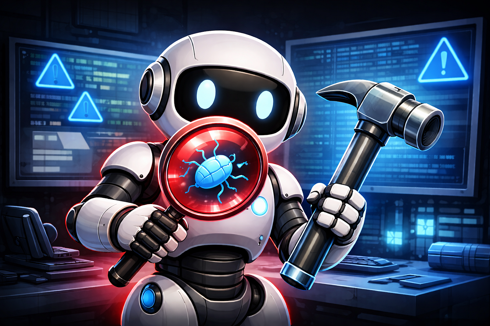
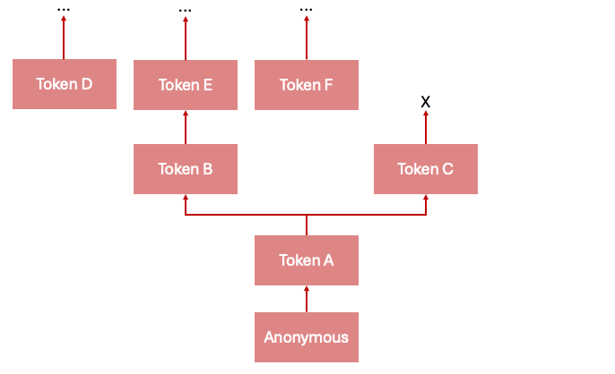

# How to Find and Fix Bugs Using AI Agents

We need AI Agents that discover issues, comprehend impact, and initiate prioritized remediation.

Static secret scanners are insufficient alone. They don't understand impact or prioritize remediation very well. For this project, I wanted to see if I could build an AI agent that could discover one leaked credential, spread to find more credentials, and then safely initiate the rotation and removal of all discovered secrets.

<!-- more -->

## Environment

To simulate a realistic production environment, I created an Artifactory lab in Docker and seeded it with:

- Multiple user accounts with varying permissions
- Repositories containing realistic, functioning code
- Live Artifactory tokens distributed throughout artifacts. Placement was deliberately uneven so the agent would hit dead ends and need some improvements and guidance.

The goal was to create realistic testing infrastructure where my agent could operate on a recon loop safely.

## Recon Agent

The next step was to create the AI agent that could iterate over the lab, looking for valid credentials:

- pull repos, given the current permissions (anonymous or authenticated)
- scan for Artifactory tokens (log the token, owner, attack path, additional access obtained, etc)
- use discovered tokens to escalate privileges and continue the scanning loop
- exit criteria: after N iterations, or when token to repo X is found, etc

The output that matters is not the list of tokens found. It is the **chain**: which credential led to which repo led to which credential, etc. A flat finding list is what a scanner produces. **The chain tells you which single finding, if remediated, would immediately limit the blast radius.**

## Recon Guardrails

A few safety precautions were front of mind during the recon phase:

- Don't leak secrets to the 3rd party model provider
- Log traffic for deconflict, debugging, etc
- Don't DOS the system

To keep active secrets from the agent, I incorporated Skills and scripts that would _enable_ the agent to find secrets, while never allowing the agent to actually _see_ them. To do this, I created a Skill to run a custom script to fetch artifacts, then grep out any valid Artifactory token into a file the agent couldn't access. The fetch script would then use tokens from the loot file, while always keeping the credentials at least one step away from the agent's eyes.

_Another potential route could be to connect to AWS Bedrock to use Claude models that don't train on your data._

As the agent iterated on the loop, the tools would each output appropriately-sanitized logs that would aid in further automation, debugging, manual validation, or deconflict in the case of incident response and deescalation.

As I'll cover next, logs were also created to assist in prioritization of remediation efforts.

## Autonomous Patching

Okay, first off, I did not autonomously invalidate every credential I came across. While that would effectively remediate all findings, it would also be extremely disruptive in a production operating environment. However, I did gather appropriate remediation data and setup a reporting structure to facilitate the rotation and removal of the discovered credentials.

The most important data I gathered was:

- Location of valid credential (repo/artifact name, line number)
- Name of possible committers (file created by, last modified by, last downloaded by)
- Impact (how easily it was discovered, how many secrets would no longer be accessible by rotation of this secret, what other repos it granted access to)

At this point, given it's just a lab, I wasn't going to actively file tickets. But we easily could — that's trivial. We could probably just hook up to a Jira MCP server or write a quick Skill and script to file the tickets to their probable owners with relevant information.

## Why This Matters

This is impact. Spending a couple days to build an agent that effectively closes dozens/hundreds/thousands of exploitable attack paths can legitimately save a company from a real data breach. And it doesn't take a funding a full team or a million-dollar contract to do so.

After I run successful red team operations, I often make recommendations based on "what would have stopped me". **Building autonomous vulnerability discovery and remediation tools now, while the tech is fresh, gives us a head start on closing doors to adversaries when they come knocking.**

## Next Steps

AI research for global impact, not application-specific.
