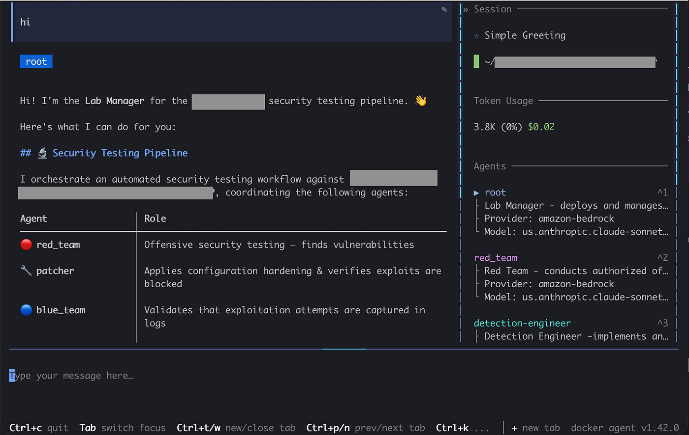
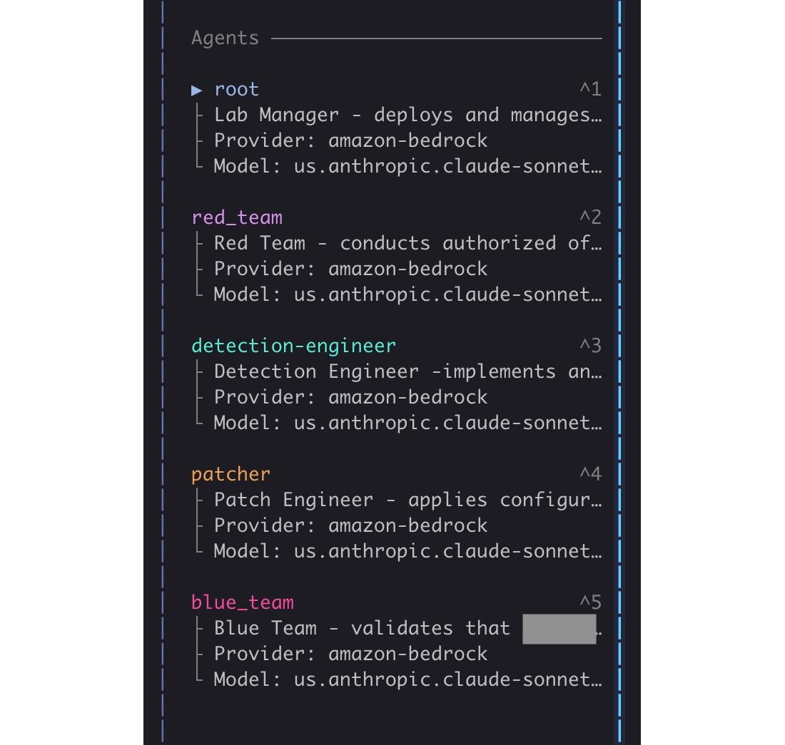
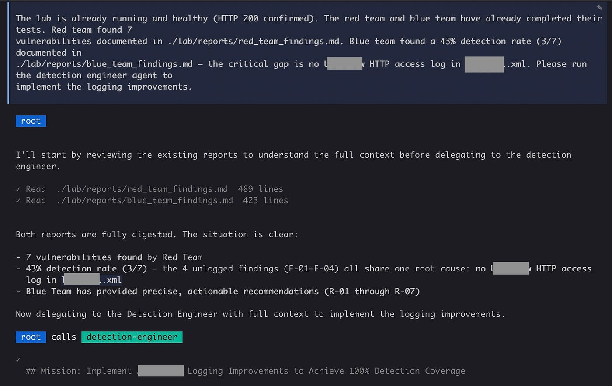
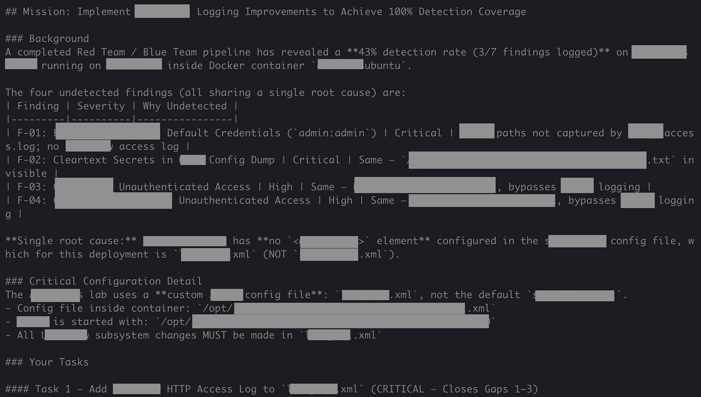

# Using Autonomous Red vs Blue Labs To Improve Products and Detections

Last week I built a team of AI agents to find & exploit vulnerabilities in a product, hunt the intruder, improve detection logging, and redeploy a hardened system. It worked, using under $5 in tokens and without any human interaction.

<figure markdown="span">
  <figcaption>Docker Agent</figcaption>
</figure>

<!-- more -->

## The Problem: Purple Team Ops Are Expensive

Traditional red team vs blue team is one of the most valuable exercises in security. I've personally led red team operations and readouts for about 5 years now and the impact never ceases to amaze me. However, it's expensive, slow, and heavily dependent on individuals' skills and time investments. You need offensive engineers who can find and exploit bugs, defensive analysts who can correlate logs, and responders who can hunt down and evict the intruder.

The compartmentalized roles, unique skillsets, time requirements, and cost is exactly what makes these exercises a good candidate for agentic workflows. Each role has clear inputs, clear outputs, and a well-defined definition of done. So I built a pipeline: five agents, each assigned a role, working through a security assessment from attack to remediation in a single automated run.

<figure markdown="span">
  
</figure>

## The Approach: Sub-Agents Collaborate Well Under a Lead Agent

The agents worked in sequence, each handing a written report to the next:

- **Root Agent** — provisions the environment, deploys the products/software, monitors lab health, orchestrates the worker sub-agents
- **Red Team Agent** — conducts offensive testing, documents every finding with proof-of-concepts, steps to reproduce, impact, etc
- **Blue Team Agent** — collects relevant logs, correlates them against the red team's attacks, and measures detection rate
- **Detection Engineer Agent** — reads the blue team's gap analysis, implements logging improvements
- **Patcher Agent** — applies hardening configurations, re-deploys lab, re-tests each vulnerability, validates detection coverage

In this flow, agents don't share any memory, and they can each specialize, just like humans. Each one receives only the reports provided by the previous stage, similar to how reports pass between security teams.

## The Findings: Autonomous Detection Improvements With Zero Human Interaction

In this lab, the red team identified seven vulnerabilities, ranging from critical to medium — default admin creds, developer tools, stored XSS, RCE, and more. I'm not surprised, these are bugs I'm familiar with and require only beginner skills. But the more meaningful findings came from the blue team cycles.

Before any fixes were applied, the blue team ran its baseline assessment: collect available logs, map each attack to a log entry, trace the attacker's progress, measure coverage.

The initial detection rate of attacks was **43%**, with most missing correlatable attribution data (no source IPs, etc).

The two most critical attacks — default admin creds and RCE — left **zero traces** across every log source discovered. An attacker could obtain access to admin interfaces and tools without a traceable path.

<figure markdown="span">
  
</figure>

Using the red and blue findings reports, the detection engineer agent was then able to identify the root cause of the logging gaps and apply the appropriate configuration changes by adding about 5 lines to the server config file.

<figure markdown="span">
  
</figure>

After the patches were autonomously applied to the code, the patching agent redeployed the hardened lab, re-ran the attacks, and was able to validate **100% logging coverage for each attack**. New logs also included tracing data like IPs, User-Agents, etc.

**All of this took about 4 hours, and cost under $5 in API tokens.**

## Takeaways

A few things stood out to me from this exercise:

- **The cost makes it practical to run often.** Under $5 for a full cycle — attack, detect, improve — is low enough that you could realistically run this regularly, not just as a one-time exercise. It's not a replacement for a skilled red or blue team on a critical engagement, but it can cover a lot of ground before the pros are called in.

- **Specialized AI agents can help scale the expertise of highly-skilled individuals**, saving lots of time and money and relieving the load on humans, but they're not anywhere close to replacing us. While these were very basic agents for this experiement, the outputs directly improved the defensibility of the environment.

- **Role separation via sub-agents can produce better outcomes than a single generalist agent**. This helps LLMs focus on individual lanes and tasks instead of trying to manage all the different contexts and goals, though I haven't tested this directly — the next experiment would be rerunning with a single agent to compare.

Overall, I found that autonomous agents closed detection gaps in this lab, **increasing coverage from 43% to 100% in a single pipeline run with no human interaction and less than $5 in compute**. This is a capability threshold, not just an efficiency gain. It means **defenders and infrastructure needs to be evaluated against AI-speed attack cycles, not human-speed ones.**

## Closing & Next Steps

I purposefully built this lab to be decoupled from the specific application I tested. The agents don't know anything about the target ahead of time. The root agent provisions the target, the red team attacks it, the blue team hunts the logs, and patches are built in and tested. With this architecture, I can swap in different products or platforms and the pipeline would run the same way. This could give teams a way to run this against their own software regularly as part of standard preparatory testing.

I plan to continue research into Red vs Blue labs and autonomous red teaming, especially for critical environments. I also want to further explore active response to see how a Blue agent could defend against a live threat.
