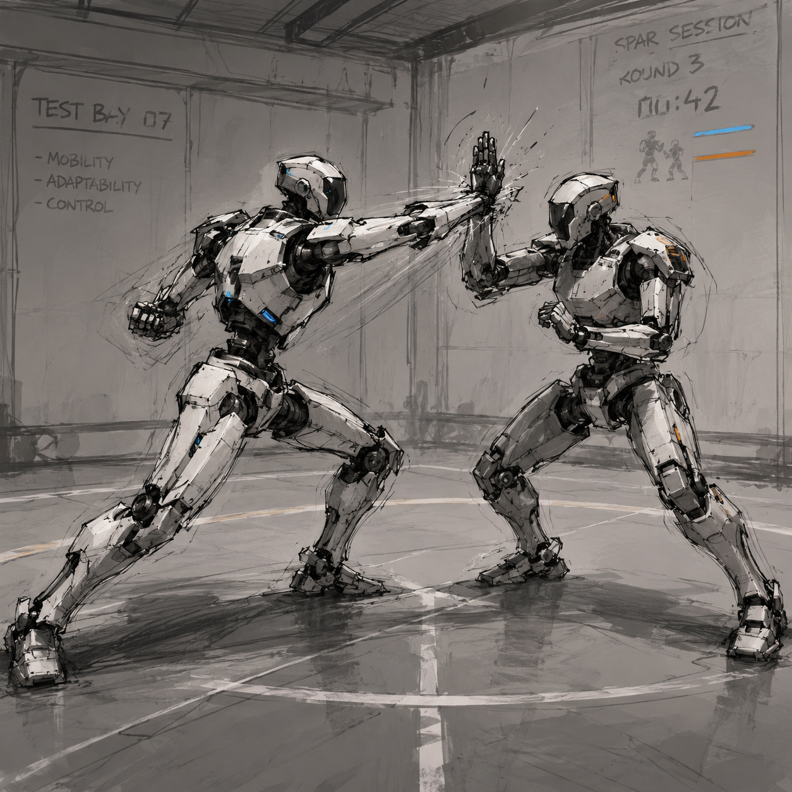

# Sparring with Agents: Defending Against Autonomous Attacks

I recently built an autonomous attack system and deployed it against several live production systems. After successfully reaching post-exploitation impact, I asked myself what would have stopped it, and I came up with several potential metrics that organizations might track to measure and improve their defensibility specifically against autonomous attackers. In this post I'll introduce three of those metrics and some early, untested ideas for influencing them.

Two caveats up front. First, these ideas are in their infancy. I haven't validated them yet, but I plan to soon. Second, everything here comes from analyzing one attack system &mdash; my own. Admittedly, coming up with defenses against my own offensive agents risks overfitting to my tooling rather than to autonomous attackers in general, so treat these as hypotheses and starting points for your own measurements, not as a tried and true framework.

_These attack agents are tightly guardrailed and closely monitored. I plan to share more about the system in another post._

<figure markdown="span">
  
</figure>

<!-- more -->

## What Sets Autonomous Attacks Apart

Modern AI agents can operate at a speed and scale humans can't match. That makes them particularly dangerous in cyber attacks because they can find and chain weaknesses faster than a human operator. It's helpful to set aside some of the traditional security mindset and instead think about how an agent actually reasons and acts during an attack. As we'll see, some defenses that work well against human attackers don't translate well to machine-speed ones.

## What Would Have Made Attacking Harder

After each meaningful step forward in a red team operation, I ask myself _what would have stopped me, or made this harder?_ The answer often becomes a recommendation during my readouts. _Side note: this post-mortem evaluation can be helpful, but it ommits analysis of the attacks paths I didn't take._

Evaluating my own autonomous attacks, three themes kept coming up that I think would have made my attacks more difficult:

- Slowing my agents down
- Confusing my agents
- Increasing the cost of my agents

Translating these into things an organization could actually measure, I came up with these three metrics:

- **Time to Success** &mdash; time between first action and completion of objective
- **Total Commands** &mdash; number of actions or commands the agent executed
- **Total Cost** &mdash; tokens consumed (or dollars spent) by the agent

These are closely correlated &mdash; they mostly revolve around how many steps the agent takes, just measured in time, count, and dollars. Generally, more steps usually means more time and tokens.

However, they can also be independent of each other. Parallelized agents can execute quicker (high Total Commands, low Time to Success). An agent doing deep multi-step reasoning can burn tokens without issuing many commands (high Total Cost, low Total Commands). This is why I break them out &mdash; for detailed separation. But they do often move together.

### Time to Success

The initial thought here is standard blue team doctrine. The longer an attack takes, the more time defenders have to detect and respond. But that paradigm was built for human attackers &mdash; it breaks under the pressure of autonomous attacks.

If your detection and response is still running at human speed, taking 30 minutes to a couple hours, then slowing an attack from 5 minutes to 20 minutes doesn't do a whole lot &mdash; the attack is still over before you've responded. So increasing Time to Success is only useful as a defensive metric if the delay enables detection and response processes to trigger and play out. In other words, if you can get the attacking agent to generate more detectable telemetry, and then slow it down long enough for incident response, then that's a win.

With that in mind, here are some ways we may be able to slow down autonomous attacks, and ideally make them noiser while we're at it:

- **Confuse the agent with misleading or complex content.** Think of this as a form of social engineering against the agent via indirect prompt injections. Planting files that misdirect it or misrepresent the system architecture can send it down dead ends. A capable agent will recover, so treat this as a speed bump, not a wall.
- **Overload the agent's context with large or numerous files.** This can induce prompt drift or, if the system compacts context, cause it to lose earlier findings and have to re-discover them, burning time and tokens to do so. There are ways around this, such as using `grep` and `find` to conduct targeted searches instead of ingesting whole files, but this may still prove useful against less-mature agents.
- **Plant canary tokens and invalid credentials.** While using canary tokens should trip detections immediately, attempting to validate fake credentials generates more network calls and telemetry. At this point, you may as well make all the invalid tokens canaries though. In either case, the waste of attacker time is a benefit, but the alert is the real point.

### Total Commands

More commands to reach an objective drives up both Time to Success and Total Cost, since more steps generally means more time and tokens. But an increase in total commands also means an increase in telemetry. Every command is a chance for something to log, alert, or leave a trace. 200 steps instead of 20 to reach the same objective means 10x more opportunities for a detection to fire.

Here are a few potential ways to accomplish this:

- **Increase your filesystem footprint.** Creating a larger folder structure hierarchy with nested subfolders and file references can cause the agent to traverse more directories and filepaths.
- **Obfuscate file paths.** Similar to confusing the agent, this can impact agents' abilities to use file paths to reason about context and attack paths. To keep things simple for engineers, a local git-ignored legend could guide local coding agents when developing, or a last-minute obfuscation system could apply the changes during deployment (like JS minification).

### Total Cost

Today's best performing models are paid frontier models. Open-weight alternatives are close behind, but frontier models still excel at the long-horizon, multi-step reasoning that autonomous attacks benefit from. The idea here is, if you can force an attacker onto the most expensive models, you raise the cost of the attack.

Take this with a grain of salt though. A fully-autonomous attack can easily cost under $10, which isn't really a blocker to any serious attacker. But if an attacker is scaling their agents across hundreds or thousands of systems, that could rack up a bill. Honestly though, with the open-weight gap narrowing, and assuming most attackers can spare a few dollars, this probably isn't a great goal. More of a thought.

One area where increasing Total Cost may be worthwhile is if the cost increase also increases detectable telemetry. If you want to increase token consumption (where directly correlated to price), then the same tactics as before can work: host numerous or large files and inject distractions into READMEs and files that may confuse or inflate the agent's reasoning. However, these may also pollute the production environment.

## Moving the Numbers

After establishing baselines and giving teams time to implement changes, we can re-run the same attacks and compare. These before/after result sets are the real payoff, as they're concrete, repeatable measurements of whether defensive changes have actually helped.

Remember though that LLM agents are non-deterministic. Re-running "the same attacks" again is not a clean A/B test, and variance between re-runs could muddy the metrics. You may be able to avoid this by collecting averages from multiple tests before and after improvements.

These ideas are still fresh, so empirical testing is necessary to evaluate their effectiveness. Additionally, further consideration is needed regarding the potential impact these countermeasures may have on legitimate workflows. Confusing file paths and misleading READMEs can lose a legitimate user just as easily as an attacking agent. Several of these tactics may not be worth it in a real environment, and some may not be feasible at all. And remember, these are just speed bumps &mdash; agents can adapt and learn to bypass these.

## Takeaways

Ultimately, reframing how we consider defending against an aggressive reasoning machine can help us come up with new countermeasures. _Can we slow it down? Can we confuse or distract it? Can we deter the operator by increasing time or price of attacks?_ Even if we're unable to accomplish these goals, we may be able to force additional detectable telemetry from attackers, and that improves our ability to detect and respond. Again, these ideas and metrics presented are just initial thoughts, and still need testing.

## Closing & Next Steps

Adversarial testing and baseline measurements are only the first half of the equation. The point is to turn those measurements into real security change. Next, I plan to test these theories to find out which of these tactics actually slow, confuse, or cost an autonomous attacker. Every round of sparring &mdash; testing, measuring, adjusting &mdash; should leave the defense a little better than last time.
