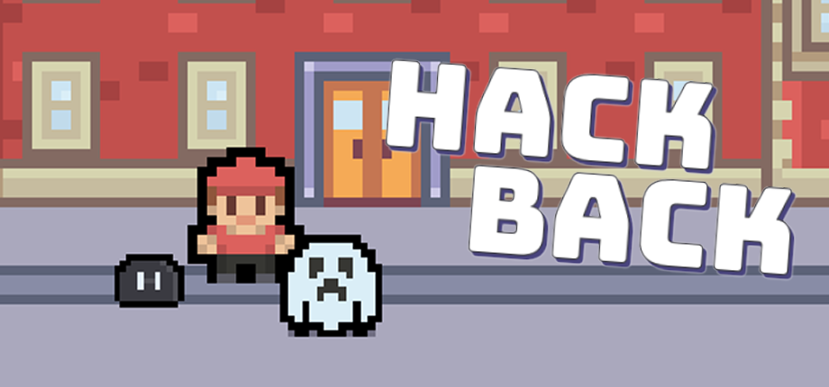

# Hack Back

In 2024, I developed **Hack Back**, a real-time strategy game where you play through a fun campaign as an Offensive Security Engineer. Inspired by StarCraft, you control various heroes and units to launch network attacks against MegaCorp bad guys while defending your own base from counterstrikes.

The game incorporates cybersecurity principles into engaging gameplay mechanics to teach the world about offensive and defensive security concepts in a simple way.

## Gameplay

- **Real-time strategy** — control units, manage resources, build your base, and decide when to strike, stay stealthy, or fall back
- **Campaign-driven narrative** — follow a protagonist who joins a security consulting firm and gets pulled into escalating conflict
- **Accessible by design** — hacking mechanics are woven into gameplay rather than dumped in a terminal, so anyone can pick it up

## Current State

I released the first two levels of the game for **free** on Steam. I currently don't have plans of continuing development past these initial two levels. Last I checked, there were about 14k downloads.

[:simple-steam: Free Download on Steam](https://store.steampowered.com/app/3709680/Hack_Back/){ .md-button .md-button--primary }
